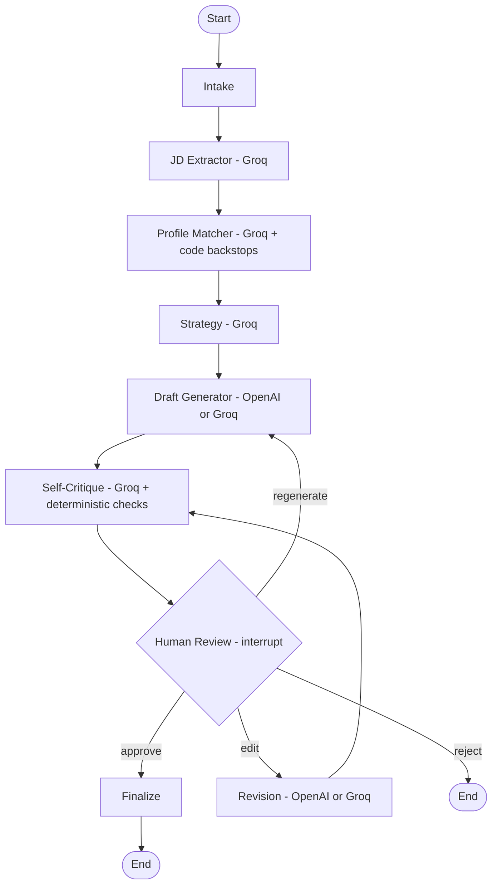

# DRAFTRON

**An honesty-first cover letter agent, built with LangGraph.**

DRAFTRON takes a job posting and a candidate's profile, and produces a
tailored cover letter through a multi-stage agent pipeline — with a human
approval gate before anything is finalized, and a design philosophy that
prioritizes *not overstating the candidate's fit* over sounding impressive.

This is Week 1 of a self-directed 6-week agent-building challenge (DRAFTRON →
CORTEX → SCOUT → INBOXA → PATHRA → NEXARA), each shipped as its own deployed
agent before the next is started.

---

## Table of Contents

- [Why this project is interesting](#why-this-project-is-interesting)
- [Architecture](#architecture)
- [Design principles](#design-principles)
- [Model routing](#model-routing)
- [Project structure](#project-structure)
- [Setup](#setup)
- [Usage](#usage)
- [Testing](#testing)
- [Known limitations](#known-limitations)
- [Roadmap](#roadmap)

---

## Why this project is interesting

Most "AI cover letter generator" demos optimize for one thing: does it sound
good? DRAFTRON optimizes for a harder, less flattering property: **does it
sound good *and* stay honest about what the candidate can actually back up.**

That constraint shapes almost every design decision in this repo:

- A **skill-matching stage** that explicitly separates what's evidenced by a
  real project from what's merely listed — and refuses to inflate a thin
  match into a confident pitch.
- A **`do_not_claim` list** that follows the letter through every later
  stage (drafting, revision, QA) as a hard constraint, not a suggestion.
- A **self-critique node** that runs *before* a human ever sees the draft,
  catching literal leaks, paraphrased overstatements, generic filler, and
  formulaic phrasing automatically.
- **Deterministic backstops layered on top of LLM judgment** wherever
  testing showed the model was unreliable at an *exhaustive* check (e.g.
  cross-referencing every posting skill against every profile tag) — even
  at temperature 0. Code enforces certainty where the model only offers
  probability.

## Architecture

DRAFTRON is a `LangGraph` `StateGraph` with a single human-in-the-loop
checkpoint, built with `interrupt()` — the graph pauses to let a human
review, edit, regenerate, or reject the draft, and resumes exactly where it
left off.



### A typical run

1. **Intake** — loads the candidate's `profile.json` and the pasted job
   posting. Fails loudly (not silently) if the profile is missing, malformed,
   or missing required keys — a bad profile here would otherwise poison
   every downstream node with no clear signal of where it went wrong.
2. **JD Extractor** — parses the posting into structured requirements
   (required/nice-to-have skills, seniority, culture signals, key
   responsibilities) via a Pydantic-bound LLM call.
3. **Profile Matcher** — the honesty-critical stage. Classifies each posting
   skill as matched (evidenced by a real project or certification) or a gap,
   picks which of the candidate's projects are genuinely relevant, and
   states the strongest honest angle. Backed by three deterministic
   backstops (see [Design principles](#design-principles)).
4. **Strategy** — decides tone, framing, and which project leads the letter,
   as a brief for the writer — not letter-ready prose.
5. **Draft Generator** — writes the actual letter body: 3 short paragraphs,
   grounded only in what the strategy brief provided, with a standing set of
   hard constraints (no `do_not_claim` skills, no education mentions, no
   fabricated employment history, no generic enthusiasm language).
6. **Self-Critique** — a QA gate combining mechanical checks (word count,
   literal keyword leaks, formulaic-phrase pattern matching) with LLM
   judgment (tone alignment, paraphrased overstatement, filler detection) —
   before a human ever sees the draft.
7. **Human Review** — the graph pauses here via `interrupt()`. A flagged
   draft doesn't get silently blocked or silently approved — the human sees
   it either way, with the flagged issues surfaced and an auto-generated,
   fully-editable suggested edit if they choose to revise.
8. **Revision / Finalize** — edits loop back through self-critique before
   the human sees the result again; approval assembles the final letter
   (salutation + body + sign-off) and logs the application.

## Design principles

A few decisions worth calling out, since they came from real failures found
during testing, not just up-front planning:

**Code beats prompts for exhaustive/mechanical checks.** Across testing,
certain LLM judgment tasks — cross-referencing every posting skill against
every profile tag, counting words, catching a specific banned phrase —
proved unreliable *even at temperature 0*, because they're closer to
systematic enumeration than reasoning. Rather than keep rewording prompts
against failures that kept recurring under new phrasings, those checks moved
to deterministic Python:

- `_enforce_exact_matches` — guarantees a literal profile-tag match
  (e.g. "voice AI") is never missed as a skill gap.
- `_enforce_unverified_skills` — guarantees a skill the candidate can't
  actually back up never counts as matched, regardless of what the model
  decided.
- `_drop_invalid_gaps` — strips anything the model invented that isn't
  actually one of the posting's own required/nice-to-have skills.
- `_find_literal_leaks` / `FORMULAIC_OPENER_PATTERN` in self-critique —
  catch restricted claims and the recurring "I am [feeling adjective] to…"
  pattern with certainty, rather than hoping the model avoids a phrase it
  had already been explicitly banned from using in an earlier prompt
  revision.

**The LLM still owns genuine judgment calls** — is this project's domain
actually relevant to this posting, does this sentence read as generic filler,
does a phrase paraphrase a restricted claim without using the literal word.
These aren't lookups; they stay as LLM calls, deliberately.

**A failed QA check never silently blocks or silently overrides the human.**
When `self_critique` flags a draft, the UI doesn't auto-reject it (the human
might reasonably disagree with a flag) and doesn't approve it with the same
one-click ease as a clean draft either — Approve is visually de-emphasized
and gated behind an explicit acknowledgment checkbox until the human
confirms they've seen the flags.

**Fail loud, not quiet.** A missing or malformed `profile.json`, a
`lead_project` id that doesn't resolve to a real project — these raise
immediately rather than degrading into a vague, silently-wrong letter three
nodes later.

## Model routing

Different nodes use different models, chosen deliberately by task type
rather than defaulting to one model everywhere:

| Node | Task | Provider | Why |
|---|---|---|---|
| JD Extractor | Structured extraction | Groq (free tier) | Classification task, doesn't need frontier reasoning |
| Profile Matcher | Matching + reasoning | Groq (free tier) | Backed by code-level backstops for the exhaustive parts |
| Strategy | Light reasoning | Groq (free tier) | Producing a brief, not prose |
| Draft Generator | Creative writing | OpenAI (configurable) | The one place output quality genuinely matters |
| Self-Critique | Judgment + QA | Groq (free tier) | Paired with deterministic checks for the mechanical parts |
| Revision | Creative writing | OpenAI (configurable) | Same reasoning as Draft Generator |

The generation provider is swappable via `.env` (`DRAFTRON_GEN_PROVIDER` /
`DRAFTRON_GEN_MODEL`) without touching code — the public deployment runs on
Groq to avoid exposing a personal OpenAI bill to arbitrary traffic; a local
`.env` can point at OpenAI for higher-quality personal use.

## Project structure

```
draftron/
├── app.py                        # Streamlit UI
├── graph/
│   ├── state.py                  # CoverLetterState + Pydantic schemas
│   ├── builder.py                # DraftronGraph -- assembles + compiles the StateGraph
│   ├── edges.py                  # conditional routing after human_review
│   └── nodes/
│       ├── intake_node.py
│       ├── jd_extractor_node.py
│       ├── profile_matcher_node.py
│       ├── strategy_node.py
│       ├── draft_generator_node.py
│       ├── self_critique_node.py
│       ├── human_review_node.py
│       ├── revision_node.py
│       ├── finalize_node.py
│       └── _shared.py            # helpers shared across nodes (e.g. find_project)
├── models/
│   └── router.py                 # Groq / OpenAI client factory
├── prompts/                      # externalized system prompts, one per node
├── data/
│   ├── profile.json              # candidate's structured profile (see Setup)
│   └── applications_log.jsonl    # append-only record of finalized applications
├── outputs/                      # generated letters land here
├── tests/
│   ├── fixtures/postings/        # sample job postings used across the test suite
│   ├── test_day2.py … test_day5.py
│   └── test_graph.py             # full compiled graph, real interrupt()/resume()
├── pyproject.toml
└── .env.example
```

## Setup

Requires Python 3.10+ and [`uv`](https://docs.astral.sh/uv/).

```bash
git clone <this-repo>
cd draftron

# install dependencies and register the project as an editable package
uv pip install -e .

# configure API keys
cp .env.example .env
# then fill in OPENAI_API_KEY and GROQ_API_KEY
```

**Build your `data/profile.json`.** This is a one-time, hand-curated file —
skills (by category), projects (with real highlights and tags), certifications,
education, and a `letter_generation_notes` block flagging any skill you've
listed but can't yet back up with a real project (`unverified_skills`).
Automated resume ingestion is intentionally out of scope for this project —
see [Known limitations](#known-limitations).

## Usage

```bash
uv run streamlit run app.py
```

Paste a job posting, generate a draft, and review it. On a flagged draft,
the feedback box is pre-filled with a suggested edit instruction generated
from the actual critique flags — editable, or clearable to write your own.
Every finalized letter is saved to `outputs/` and logged to
`data/applications_log.jsonl`.

## Testing

The test suite grew alongside the graph, day by day, and deliberately
includes adversarial cases, not just happy-path runs:

- `test_day2.py` — router health check, intake, JD extraction across three
  fixture postings chosen to stress different extraction edge cases (a
  clean required/nice-to-have split, a sparse posting, an unstructured one).
- `test_day3.py` — adds profile matching and strategy, including an explicit
  "honesty stress test" posting with almost no real skill overlap.
- `test_day4.py` — adds draft generation and self-critique, including a
  hand-constructed adversarial draft to confirm the QA gate actually catches
  a known violation rather than only ever having seen clean drafts.
- `test_day5.py` — exercises the edit/revision loop directly, including a
  two-round feedback scenario that checks round 1's request isn't silently
  undone by round 2's edit.
- `test_graph.py` — the full compiled graph via the real `interrupt()` /
  `Command(resume=...)` mechanism, no mocking: approve path, reject path,
  and a full edit-then-approve loop.

```bash
uv run python tests/test_graph.py
```

## Known limitations

- **`profile.json` is manually built.** Turning an arbitrary uploaded CV/PDF
  into structured data properly (chunking, embeddings, retrieval at scale)
  is the explicit goal of **CORTEX**, Week 2 of this challenge — building
  that here would mean rebuilding it without the RAG infrastructure meant to
  back it.
- **The public deployment intentionally uses Groq, not OpenAI**, so
  arbitrary traffic can't run up a personal API bill. Letter quality on the
  public demo reflects that tradeoff; a locally-run instance with an OpenAI
  key produces stronger prose.
- **A handful of deterministic backstops exist because LLM judgment proved
  unreliable on specific exhaustive checks during testing** — this is
  disclosed deliberately above, not hidden, since knowing *where* a system's
  probabilistic components need a certainty backstop is itself part of the
  engineering.

## Roadmap

| Week | Agent | Focus |
|---|---|---|
| 1 | **DRAFTRON** | LangGraph HITL, multi-model routing, this repo |
| 2 | CORTEX | RAG + FastAPI — shared CV/LinkedIn knowledge base for all later agents |
| 3 | SCOUT | MCP + external job search APIs |
| 4 | INBOXA | HITL + Gmail API for email triage |
| 5 | PATHRA | Long-term memory for learning recommendations |
| 6 | NEXARA | Multi-agent supervisor + A2A protocol, orchestrating all five |
